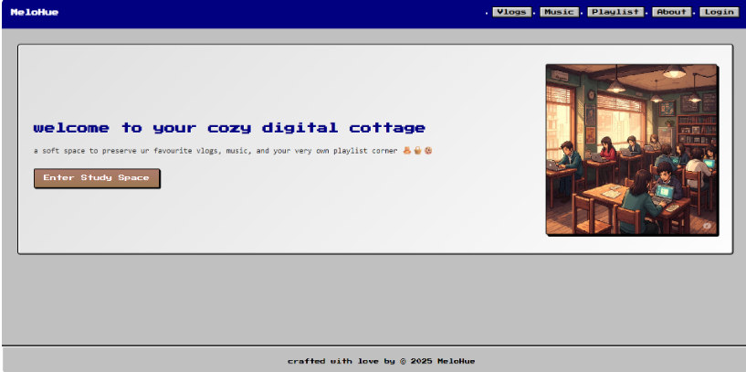
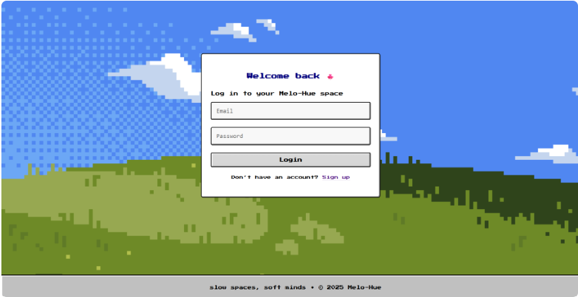
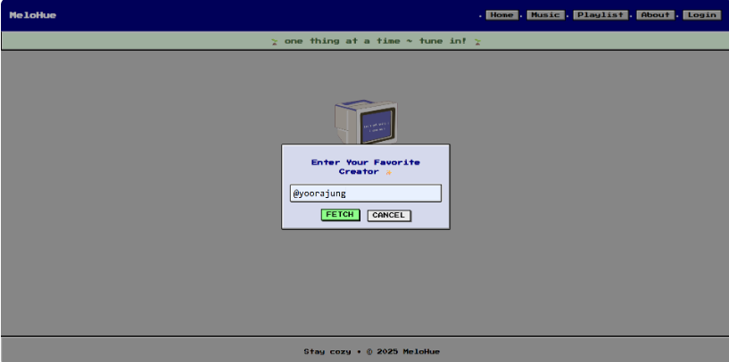
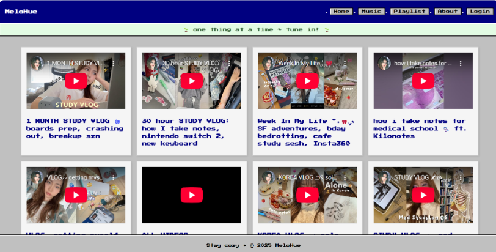
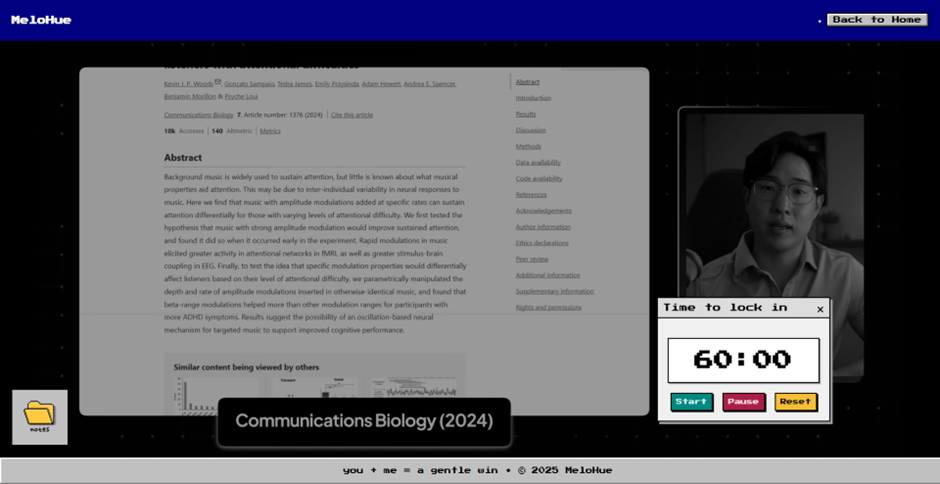
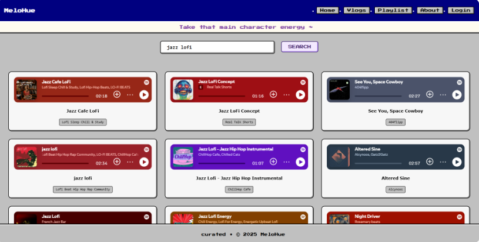
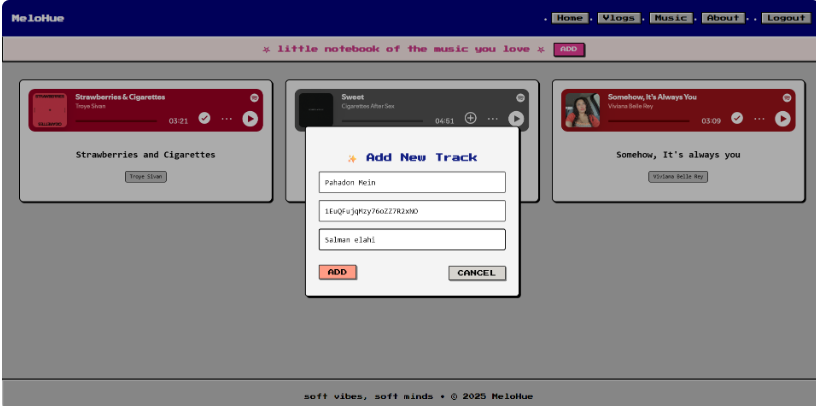
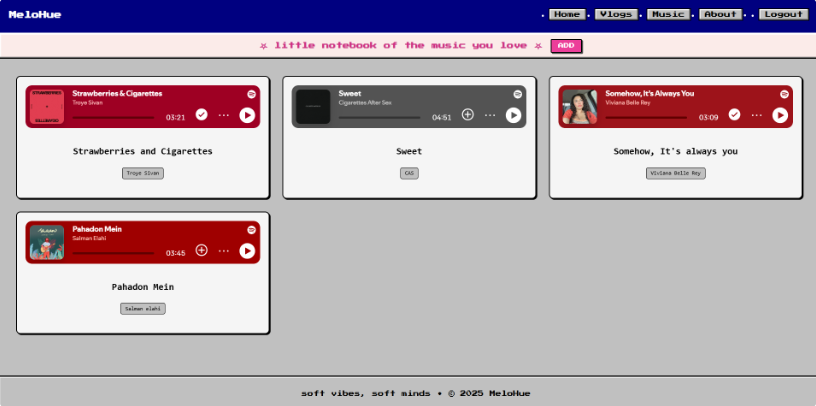
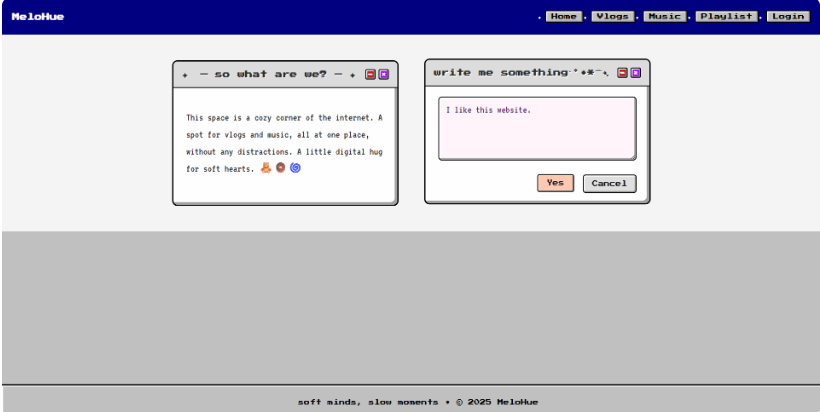

<div align="center">

# 🎵 MeloHue


</div>

## Overview

No more app switching, no more rabbit holes.

MeloHue is an interactive personal website that blends **retro Windows XP-era design aesthetics** with smooth, modern web interactions, creating a distinctive digital space that's equal parts nostalgic and functional.

Designed for users who value simplicity and productivity, MeloHue brings your favorite media, focus tools, and music discovery into one distraction-free environment.

## Features

### I] Channel & Music Hub
Browse your favorite vlog channels and music in a single, curated, distraction-free space 

### II] Focus Mode
Enter a deep-work session with a randomly fetched **"Study With Me"** YouTube video, pulled live via the YouTube Data API. 

### III] Spotify Integration
Search tracks, preview playback, and personalize your music taste from Spotify - all without leaving MeloHue.

### IV] Music Notebook
Maintain a personal notebook of songs you connect with. Save, revisit, and reflect on your musical journey over time.


## Tech Stack

HTML | CSS | JavaScript | Youtube Data API | Spotify API | Node.js | Express.js | MongoDB | Redis & Docker


## 🔌 APIs & External Services

### YouTube Data API
Fetches relevant background study videos and channel content dynamically for Focus Mode.

### Spotify API
Powers music search, playback preview, and playlist management within the app.

### Icons & Fonts
- **Icons:** Canva Free Icons - used under Canva's free license policy.
- **Fonts:** Sourced from [Google Fonts](https://fonts.google.com/) - free for personal and commercial use under the [Open Font License (OFL)](https://scripts.sil.org/OFL).

---

## 🐳 Running with Docker

```bash
# Clone the repository
git clone https://github.com/your-username/melohue.git
cd melohue

# Start the backend
docker compose up --build
```

Make sure to set up your `.env` file with the required API keys before running:

```env
YOUTUBE_API_KEY=your_youtube_api_key
SPOTIFY_CLIENT_ID=your_spotify_client_id
SPOTIFY_CLIENT_SECRET=your_spotify_client_secret
REDIS_URL=redis://localhost:6379
```

---



















---
## Copyright

© MeloHue. All rights reserved.
**Copyright registered under the Government of India.**

---

<div align="center">
  Made with 🎵 and a love for the early 2000s internet.
</div>
